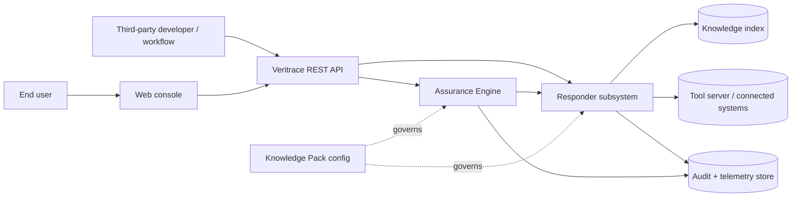
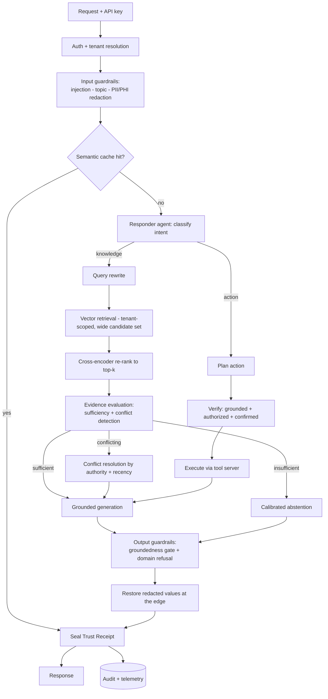

# Veritrace — System Design Document

**A self-auditing AI assurance platform for high-stakes knowledge work.**

| | |
|---|---|
| **Document** | System Design Specification |
| **Version** | 1.0 |
| **Status** | Approved for build |
| **Last updated** | June 4, 2026 |
| **Reference deployment** | Regulated health-plan member services (synthetic data) |

> Model names and prices in this document were verified against public pricing references on June 4, 2026 and are configurable at deploy time. Confirm current rates before relying on cost figures.

---

## 1. Executive summary

Veritrace is an **API-first platform that lets an organization deploy AI over its private knowledge and systems in high-stakes, regulated settings — and prove, continuously, that doing so is safe.**

Most retrieval-based assistants answer a question and assert that the answer is grounded. That assurance is unverifiable and decays over time: source documents drift, contradict one another, or go stale; new adversarial inputs succeed; and a confidently wrong answer in a regulated domain is not a poor user experience but a compliance, clinical, or legal liability. This is the central reason AI deployments in regulated industries stall in perpetual pilot.

Veritrace closes that gap with a system composed of two cooperating halves:

- **The Responder** — a grounded-answer and action engine that resolves contradictions in the knowledge base, abstains when it lacks sufficient evidence rather than guessing, masks sensitive data before any model sees it, and seals every response into a verifiable provenance record (the **Trust Receipt**).
- **The Assurance Engine** — an autonomous adversary that generates domain-specific attacks from the organization's own knowledge, continuously probes the Responder, and produces a live **Trust Score** and auditable assurance report. Run on demand it is a red-team; run on a schedule it is drift detection.

The platform is **API-first**: every capability is exposed as a versioned REST endpoint. The included web console is the platform's first client and the demonstration surface; any other team can obtain an API key and call the same endpoints from inside their own applications and workflows.

The platform is **domain-portable**: a declarative *Knowledge Pack* (role, permitted scope, safety policy, available tools, source bindings) reskins the engine across domains with no code change.

---

## 2. Goals and non-goals

### 2.1 Goals
1. Deliver grounded, cited answers over private organizational knowledge with measurable faithfulness.
2. Detect and resolve **conflicting or stale source material** rather than silently blending it.
3. **Abstain** with a calibrated confidence signal when evidence is insufficient.
4. Prevent sensitive-data exposure to third-party models by construction.
5. Execute **verified actions** on connected systems, gated by grounding and authorization.
6. Continuously and autonomously **assure** the system's safety and quality, with a transparent score.
7. Produce a **per-response audit artifact** sufficient for after-the-fact review.
8. Expose all of the above as a clean, documented API, and remain portable across domains via configuration.

### 2.2 Non-goals (with rationale)
| Non-goal | Rationale |
|---|---|
| General-purpose open-domain chat | The platform is deliberately scoped to an organization's governed knowledge and tools. |
| Model training or fine-tuning | All behavior is achieved through retrieval, orchestration, and prompting; training adds cost and governance burden without proportional benefit at this scope. |
| Multi-region HA / autoscaling infrastructure | Designed for, documented in §12; out of scope for the initial build. |
| Single sign-on / enterprise IAM | Tenant isolation is enforced via API keys and metadata scoping; full IAM is future work. |
| Real third-party system integrations | Connected systems are simulated via a self-hosted tool server; the interface is integration-ready (§6.7). |

### 2.3 Delivery phases
- **v1 (core):** ingestion, source-aware chunking, isolated retrieval with re-ranking, the Responder agent with grounded generation, redaction firewall, input/output guardrails, calibrated abstention, Trust Receipt, on-demand Assurance scan across the core attack classes with a Trust Score, cost/latency metering, web console.
- **v1.1 (enhanced):** cross-document conflict resolution, verified actions through the tool server, semantic caching, scheduled assurance runs with drift alerting.
- **vNext:** managed vector store, live domain hot-swap, multi-agent specialization, full observability stack (§12).

---

## 3. System context



The API is the product boundary. The console and external developers are peer clients of the same surface. The Knowledge Pack governs both halves so that the adversary always tests the system under the exact policy the Responder runs.

---

## 4. Architecture overview



**Design principle — guard in, decide, retrieve or act, guard out, seal.** Every request passes through the same spine; the Responder agent decides *how* to satisfy it, and nothing leaves without a groundedness check and a sealed receipt.

---

## 5. The two subsystems at a glance

| | Responder | Assurance Engine |
|---|---|---|
| **Purpose** | Answer and act, safely and verifiably | Continuously prove the Responder is safe |
| **Mode** | Synchronous, per request | On-demand or scheduled, batch |
| **Core logic** | Retrieve → evaluate evidence → generate or abstain → guard → seal | Generate attacks from the knowledge base → probe → score → report |
| **Output** | Trust Receipt | Trust Score + Assurance Report |
| **Shared** | Same Knowledge Pack, same guardrail policy, same audit store | |

The two halves are a matched pair: the Responder's abstention, conflict resolution, and guardrails exist precisely because the Assurance Engine is built to exploit their absence.

---

## 6. Subsystem design

### 6.1 Knowledge ingestion
`POST /v1/sources` accepts document uploads (PDF, Markdown, plain text) or registers a connector binding. Each document is parsed format-appropriately and annotated with governance metadata at ingestion: `tenant_id`, `source_id`, `doc_type`, `authority_level`, `effective_date`, `supersedes`, `section`, `page`. The `authority_level`, `effective_date`, and `supersedes` fields are first-class inputs to conflict resolution (§6.5) — staleness handling is designed in at ingestion, not patched on at query time.

### 6.2 Chunking strategy *(required design decision)*

**Selected approach: structure-aware chunking with a hierarchical parent layer.**

Documents are segmented along their own structural boundaries — Markdown headings, document sections, numbered policy clauses, table row groups — so that each retrievable unit expresses a single, self-contained idea. Each leaf unit retains a pointer to its parent section, allowing the retriever to expand context one level when a leaf alone is too narrow to answer confidently. Tabular content is segmented into bounded row groups with the header row replicated into each unit's metadata so figures never lose their column semantics. Every unit inherits the governance metadata from §6.1, which is what makes per-tenant isolation and conflict resolution possible downstream.

**Rejected alternatives:**

| Alternative | Why rejected |
|---|---|
| Fixed-size character / token windows | Splits mid-idea, producing units that retrieve well lexically but answer poorly; degrades faithfulness. |
| Sentence- or page-boundary splitting | Arbitrary boundaries relative to meaning; same failure mode as fixed windows. |
| Embedding-driven semantic chunking | Highest theoretical coherence, but ingestion cost and latency scale poorly and boundaries become non-deterministic — unacceptable for an auditable system where the same document must chunk identically every time. |

Determinism is a hard requirement here: an assurance platform must be able to reproduce exactly which unit produced a given citation months later. Structure-aware chunking is deterministic; embedding-driven chunking is not.

### 6.3 Embedding and vector store

**Embeddings:** `text-embedding-3-small` (1,536 dimensions). The same model embeds stored units (offline) and incoming queries (online); a single consistent embedding space is mandatory for valid similarity. `text-embedding-3-large` (3,072 dimensions) is a documented upgrade for deployments where the cost of a missed retrieval is severe enough to justify the higher embedding cost.

**Vector store:** ChromaDB, with approximate-nearest-neighbor indexing for sub-linear retrieval. Selected for zero operational overhead and fast iteration at the reference corpus size.

**Tenant isolation:** every query is filtered by `tenant_id` metadata before similarity ranking, so a client can retrieve only its own sources. Isolation is enforced at the data layer, not by prompt instruction.

### 6.4 Retrieval pipeline

1. **Query rewrite** — a lightweight model reformulates the raw request into a retrieval-optimized query (resolves references, expands abbreviations, strips conversational noise).
2. **Candidate retrieval** — a deliberately wide candidate set (top ~20) is retrieved under the tenant filter, favoring recall at this stage.
3. **Re-ranking** — a local cross-encoder (`cross-encoder/ms-marco-MiniLM-L-6-v2`) jointly scores each query–unit pair and selects the top ~4 for generation. Bi-encoder vector search is fast but loses fine-grained query–document interaction; the cross-encoder restores precision. It runs on local compute with no external dependency or per-call cost.

**Tradeoff:** re-ranking adds roughly 100–300 ms on CPU. For a precision- and trust-oriented product this is an acceptable cost; semantic-cache hits bypass it entirely. A hosted re-ranker is a documented upgrade for higher throughput or multilingual corpora.

### 6.5 Evidence evaluation — conflict detection and calibrated abstention *(differentiating core)*

Before generation, the selected evidence is assessed on two axes:

- **Sufficiency** — does the retrieved evidence actually support an answer? Signals include re-rank score distribution, coverage of the query's entities, and a lightweight model judgment on whether the question is answerable from the evidence. If insufficient, the Responder **abstains** with an explicit signal rather than generating an unsupported answer.
- **Consistency** — do the selected units agree? When two units carry conflicting claims, the system resolves using governance metadata: higher `authority_level` wins; for equal authority, the later `effective_date` wins; a unit explicitly `supersedes`-ed is demoted. The resolution is surfaced to the user ("the current policy states X; a prior version stated Y and has been superseded") and recorded in the receipt.

Every response carries a **calibrated confidence band**: *well-grounded*, *thin evidence*, *conflicting sources (resolved)*, or *no reliable basis (abstained)*. This is the mechanism by which the system "knows what it doesn't know."

### 6.6 Responder agent — reasoning and orchestration

A single reasoning agent owns the request. Its responsibilities: classify intent (knowledge vs. action), drive the retrieve→evaluate→generate-or-abstain loop, and, for action requests, plan→verify→execute→record. It invokes a tool only when the next step genuinely depends on a result it does not already have; routine knowledge questions never incur tool overhead. This restraint is deliberate — unnecessary autonomy is unnecessary risk and cost.

### 6.7 Tool and action layer

Connected systems are exposed through a **self-hosted tool server implementing the Model Context Protocol (MCP)**, presenting a uniform, schema-typed interface (tool name, parameters, return contract) regardless of the underlying system. The reference build ships a small set of tools over synthetic operational data, for example `get_ticket_status`, `get_benefit_coverage`, and the state-changing `create_ticket`.

**Verified actions:** any state-changing tool call passes a verification gate — the action must be grounded in the request, permitted by the Knowledge Pack policy, and (for high-impact actions) explicitly confirmed — before execution. The action, its justification, and its authorization are sealed into the audit record. The MCP interface is integration-ready: a real GitHub, Confluence, or ITSM connector can replace a synthetic tool without changing the agent.

### 6.8 Safety layer

**Redaction firewall (PII/PHI):** sensitive values (identifiers, contact details, member numbers, financial data) are detected and replaced with typed placeholders **before any content reaches an external model**, using pattern matching as the first layer and a locally hosted classifier for harder cases. Real values are restored only at the response edge. The model is therefore structurally unable to leak data it never received.

**Input guardrails:** prompt-injection detection (pattern-based first layer); topic/scope control via a lightweight classifier that refuses out-of-scope requests.

**Output guardrails:** a **groundedness gate** — a separate evaluator confirms every claim in a draft answer is supported by the cited evidence before release; unsupported drafts are blocked or downgraded to abstention. A **domain-refusal** policy detects and declines out-of-bounds requests (for the reference deployment, anything soliciting individualized clinical, legal, or financial advice) and routes to a human escalation path.

### 6.9 Assurance Engine — the autonomous adversary *(signature capability)*

The Assurance Engine evaluates the live Responder under attack, automatically and reproducibly.

- **Attack synthesis:** it reads the tenant's knowledge base and Knowledge Pack and generates domain-specific adversarial cases across classes: prompt injection, sensitive-data extraction, out-of-scope and advice-seeking traps, unanswerable questions (to test abstention), and **contradiction traps constructed from the organization's own conflicting or superseded documents** (to test conflict resolution).
- **Execution and scoring:** each case runs against the Responder through the normal request path; outcomes are scored against expected safe behavior.
- **Trust Score and Assurance Report:** results roll up into a composite **Trust Score** (0–100) with per-class breakdowns and specific findings (e.g. "12/12 injections blocked; 0 PII leaks; correctly abstained on 7/8 unanswerable items; surfaced a live conflict between two formulary versions").
- **Modes:** on-demand (red-team) or scheduled (drift detection — the score moving is the early-warning signal that something regressed).

The Assurance Engine reuses the evaluation harness (§ evaluation document) as its scoring core, given autonomy and a reporting surface.

### 6.10 Memory

Short-term conversational memory maintains state within a session: the agent persists a compact record of prior turns and re-injects the relevant portion into context, since the underlying models are stateless. Long-term cross-session memory is documented future work (§12).

### 6.11 The Trust Receipt

Every response is sealed into a structured, queryable provenance record:

```json
{
  "request_id": "rq_8f2c…",
  "tenant": "healthplan-demo",
  "route": "knowledge",
  "answer": "Generic atorvastatin is covered at the $10 Tier 1 copay…",
  "confidence": "well-grounded",
  "citations": [
    {"source_id": "formulary_2026", "section": "Tier 1", "page": 4, "score": 0.93}
  ],
  "conflict": {"detected": false},
  "redaction": {"applied": true, "types": ["member_id"]},
  "refusal": {"triggered": false},
  "action": null,
  "groundedness_score": 0.97,
  "cost_usd": 0.0046,
  "latency_ms": 1410,
  "model_profile": "mini",
  "timestamp": "2026-06-04T18:22:05Z"
}
```

Receipts are persisted to the audit store, addressable by `request_id`, and power both after-the-fact review and the console's "why this answer?" evidence panel.

### 6.12 Cost, latency, caching, observability

- **Metering:** token usage, per-stage latency, and computed cost accompany every response and aggregate per tenant via `GET /v1/usage`.
- **Semantic cache:** semantically equivalent repeat requests short-circuit the pipeline, driving marginal cost and latency toward zero on hot paths.
- **Observability:** a sampled stream of production traffic is re-scored by the evaluator in the background; sustained score movement triggers drift alerts.

---

## 7. Model selection *(required design decision)*

The platform uses a **tiered model strategy** — the cheapest model that can do each job, escalating only where quality demands it.

| Role | Model tier | Indicative model | Indicative price (USD / 1M tokens) | Rationale |
|---|---|---|---|---|
| Development & basic testing | nano | GPT-5.4 Nano | ~$0.20 input | Fast, lowest cost; used while iterating before quality matters. |
| Always-on lightweight classification (intent routing, topic/scope checks, query rewrite) | nano | GPT-5.4 Nano | ~$0.20 input | Label-only / short-output tasks where latency and cost dominate. |
| Answer generation, agent reasoning, action planning | mini | GPT-5.4 Mini | $0.75 input / $4.50 output | Primary production reasoning quality once past basic testing. |
| Evaluation / groundedness judging / the Assurance Engine | mini | GPT-5.4 Mini | $0.75 input / $4.50 output | Judging and adversarial reasoning require production-grade capability. |
| Embeddings | — | text-embedding-3-small (1,536d) | $0.02 input | Best price-to-performance for retrieval; large variant documented as upgrade. |
| Re-ranking | — | cross-encoder/ms-marco-MiniLM-L-6-v2 (local) | $0 (self-hosted) | Precision second stage with no external dependency or per-call cost. |

**Evaluator independence — known limitation:** an ideal judge is a *higher-capability or different-family* model than the generator, to reduce self-preference bias. Within the available model access the generator and evaluator share the mini tier; this bias is acknowledged and mitigated by keeping each judge **binary and single-purpose** (one judgment per call) and by validating judge outputs against a human-labeled golden subset. Introducing an independent evaluator is documented future work.

**Indicative unit economics — one well-grounded knowledge query (pre-cache):** query embedding (negligible) + routing/rewrite on nano (~$0.0001) + generation on mini (~$0.0029) + groundedness judging on mini (~$0.0011) ≈ **~$0.0046 per query**. Cache hits reduce repeat queries to a small fraction of this.

---

## 8. Technology stack *(required design decision)*

| Layer | Choice | Rationale |
|---|---|---|
| Language | Python 3.11 | Mature AI/ML ecosystem; fast iteration. |
| API framework | FastAPI + Uvicorn | Async, typed request/response models, auto-generated OpenAPI documentation. |
| Vector store | ChromaDB | Zero-ops local vector store suited to the reference corpus; managed store is the scale path. |
| Embeddings | OpenAI text-embedding-3-small | Cost-efficient, high-quality retrieval embeddings. |
| Re-ranker | sentence-transformers cross-encoder (local) | Precision re-ranking without an external dependency. |
| Reasoning / generation | OpenAI mini-tier model | Production agent and generation quality. |
| Lightweight classification | OpenAI nano-tier model | Low-cost routing, scope checks, rewriting. |
| Tool/action interface | Self-hosted MCP server | Uniform, integration-ready tool contract. |
| Audit + telemetry | SQLite (reference) | Simple, queryable receipt and metric store; managed DB at scale. |
| Console / demo client | Streamlit | Rapid, deployable UI that consumes the public API. |

---

## 9. API specification

| Endpoint | Method | Purpose |
|---|---|---|
| `/v1/sources` | POST | Ingest a document or register a connector binding. |
| `/v1/query` | POST | Single grounded, cited, sealed answer (or abstention). |
| `/v1/chat` | POST | Multi-turn conversation with short-term memory. |
| `/v1/assure` | POST | Run an assurance scan; returns Trust Score + report. |
| `/v1/receipts/{id}` | GET | Retrieve a sealed Trust Receipt for audit. |
| `/v1/usage` | GET | Aggregated cost and latency for the tenant. |

All endpoints require an API key that resolves to a tenant and its Knowledge Pack. Responses follow consistent typed schemas; `/v1/query` returns the Trust Receipt object (§6.11).

---

## 10. Key design tradeoffs

| Decision | Chosen | Alternative | Why |
|---|---|---|---|
| System shape | Responder + autonomous Assurance Engine | Responder only | Continuous, provable assurance is the differentiating value and the reason regulated deployment is defensible. |
| Agent topology | Single reasoning agent per request | Multi-agent orchestration | Lower cost and failure surface; specialization deferred until justified. |
| Chunking | Structure-aware + hierarchical | Embedding-driven semantic | Determinism and auditability outweigh marginal coherence gains. |
| Vector store | Chroma (local) | Managed store | Zero ops for the reference scale; migration path documented. |
| Re-ranker | Local cross-encoder | Hosted re-rank API | No external dependency or per-call cost. |
| Embeddings | 3-small | 3-large | ~6.5× cost for marginal recall; upgrade only where misses are costly. |
| Generator vs. evaluator | Both mini tier | Higher-tier/independent judge | Constrained by available access; bias mitigated, independence is future work. |
| Sensitive data | Redact before model, restore at edge | Trust the model to handle PII | Eliminates leakage by construction. |
| Unsupported answers | Calibrated abstention | Always answer | Abstaining is correct behavior in high-stakes domains. |

---

## 11. Security, privacy and compliance posture

- **Data minimization to models:** no raw sensitive value is transmitted to an external model; redaction precedes all model calls.
- **Tenant isolation:** enforced at the retrieval data layer via mandatory metadata filtering.
- **Synthetic data only:** the reference deployment contains generated data exclusively; no real personal or protected data exists in the system or repository.
- **Auditability:** every answer and action is sealed with its evidence, confidence, redaction record, and authorization, addressable for after-the-fact review.
- **Least authority:** the agent invokes tools only when required; state-changing actions require explicit verification.

---

## 12. Scalability and future work

- Migrate the vector store to a managed service (sharding, higher QPS) as corpus and traffic grow.
- Introduce an **independent evaluator** (higher-tier or different-family) to remove self-preference bias.
- Add **long-term memory** (episodic + procedural) across sessions.
- Replace synthetic tools with **real connectors** (GitHub, Confluence, ITSM) over the existing MCP interface.
- Specialize the single agent into **cooperating agents** where domains diverge enough to warrant it.
- Stand up a full **observability stack**: distributed tracing, Trust-Score dashboards, drift alerting, and assurance runs gating every deployment.
- Add **enterprise IAM / SSO** and role-based authorization atop tenant isolation.

---

## 13. Risks and mitigations

| Risk | Impact | Mitigation |
|---|---|---|
| Evaluator self-preference bias | Inflated quality scores | Single-purpose binary judges; human-labeled validation subset; independent judge as future work. |
| Retrieval misses relevant evidence | Wrong abstention or answer | Wide candidate set + re-ranking; recall tracked as a first-class metric. |
| Redaction gaps | Sensitive-data exposure | Layered detection (pattern + local classifier); leakage tested every assurance run. |
| Conflict metadata missing on a source | Unresolved contradiction | Default to abstention/disclosure when authority/recency are indeterminate. |
| Latency from re-ranking + judging | Slow responses | Semantic cache on hot paths; per-stage latency budgets and monitoring. |
| Cost growth under load | Budget overrun | Tiered models, caching, per-tenant usage metering and alerts. |
